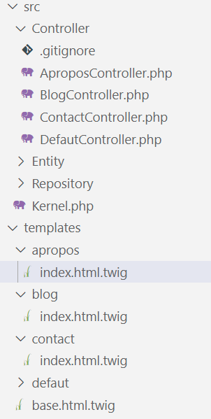

# FOAD jeudi 30/03/2023

## Instructions

## Git

- Créer un **dépôt** sur **Github**, ou autres service : [Gitlab](https://gitlab.com),[Bitbucket](https://bitbucket.org/) (car il n'y pas que Github dans la vie !) avec cette intitulé : `FOAD_DWWM_3003023_pseudo_compte_github`
- **Versionner** votre code **php** ci-dessous avec **git** sur votre ordinateur
- Entraîner vous à faire des **commits atomiques**
- Envoyer (**push**) votre travail sur votre **dépôt github** crée précédemment
- Cette etape est pas nécéssaire pour ceux qui m'ont déjà envoyé leur compte github : Envoyer moi par **email** votre **compte github** pour que je puisse voir votre travail

## Symfony

Tout ce qui suit sera basé sur la documentation de **Symfony** : [https://symfony.com/doc/current/index.html](https://symfony.com/doc/current/index.html).

## Installation

Pour pouvoir travailler avec **Symfony** il faut installer **php** et **composer**.

**php** est déjà installé car on utilise [**xampp**](https://www.apachefriends.org/fr/index.html).

**composer** s'installe en suivant les instructions [https://getcomposer.org/download/](https://getcomposer.org/download/).

Installer l'utilitaire en ligne de commande CLI `symfony` en suivant les instructions : [https://symfony.com/download](https://symfony.com/download).

Vérifier que l'installation c'est bien passé en ouvrant un **terminal**(git bash,powershell,...) , la commande suivante doit vous la version de Symfony CLI : 5.5.2 au :


## A faire

```
symfony -V
```

`Symfony CLI version 5.5.2 (c) 2021-2023 Fabien Potencier #StandWithUkraine Support Ukraine (2023-03-22T19:49:09Z - stable)`


## Créaton d'un nouveau projet

On va utiliser la ligne de commande (**CLI**) pour installer un nouveau projet , ce n'est pas une obligation d'etre dans `htdocs` de **xampp** pour utliser **Symfony**.

Afin de voir toutes les possibilitées qu'offre la **CLI** de **Symfony** , on tapant : `symfony list`

Creation d'un nouveau projet , dans un **terminal** :


## A faire

```
symfony new --webapp notre_projet
```

Renter dans le projet : 

## A faire

```
cd notre_projet
```

Lancer le serveur interne de **Symfony** : 

## A faire

```
symfony server:start -d` ou `symfony serve -d
```

Pour arreter le serveur interne de **Symfony** : `symfony server:stop`

Pour voir les logs du serveur interne de **Symfony** : `symfony server:log`

Pour sortir d'un commande qui est en cours comme les logs il faut faire la combinaison de touche `control c`

Pour connaitre l'etat du server interne à **Symfony** : ``symfony server:status`

## A faire

```
Afin de visualiser votre projet ouvir un navigateur à l'adresse http://localhost:8000/
```

On peut aussi demander à **Symfony** de lancer notre projet dans un navigateur (definit par par défault sur votre ordinateur) pour nous : `symfony open:local`

La majeur partie du temps on va travailler dans 4 dossiers dans **Symfony** :

- `config`
- `public`
- `src`
- `templates`

## Controller

[Docs Controller](https://symfony.com/doc/current/controller.html)

Dans un **Symfony** créer une page consiste à créer :

- une **route** (un chemein dans l'url) 
- un **controller** , les **controllers** sont implémentés sous forme de classes

On peut créer des **controllers** donc des classes dans des fichiers directement dans le dossier `src/Controller/` .

**Symfony** nous facilite la vie car on peut créer des **controllers** via la **CLI** et le bundle (plugin,extensions dans le monde **Symfony**) `symfony/maker-bundle` , qui est déjà installé , en effet nous avons fait une installation complete via le parametre `--webapp` lors de la création du projet :

## A faire

```
symfony console make:controller
```

Renseigner le nom de votre **controller** : `TestController`

**Symfony** vient de vous créer :
- `src/Controller/TestController.php` 
- `templates/test/index.html.Twig`

Dans la classe **TestController** se trouve :

- un **attribut** `#[Route('/test', name: 'app_test')]` pour définir la route pour accéder à ce **controler**
- une **methode** `index()` qui renvoie une **Response** ici on renvoit vers le **template** qui se strouve `templates/test/index.html.Twig` 

## A faire

```
On voir le resultat à l'url : https://127.0.0.1:8000/test
```

Dans l'**attribut** pour la **route** , on defnit un chemin `/test` et un nom pour ce chemin `app_test` qu'on pourra utliser dans notre projet pour des refirections par exemple.

La **methode** `index()` envoie un tableau avec une variable `controller_name` qu'on recupere dans le **template** `{{ controller_name }}` 

La gestion des **Vue** dans **Symfony** est géré par **Twig** [https://symfony.com/doc/current/templates.html](https://symfony.com/doc/current/templates.html) [https://Twig.symfony.com/](https://Twig.symfony.com/)

## Template , Twig

Le systeme de **template** **Twig** utiliste le dossier `templates`.

Dans le fichier `base.html.Twig` se trouve le layout , l'ossature de votre rendu.

La syntaxe de **Twig** est basée sur ces trois constructions :

- `{{ ... }}`, utilisée pour afficher le contenu d'une variable ou le résultat de l'évaluation d'une expression 
- ``, utilisé pour exécuter une logique, telle qu'une condition ou une boucle 
- `{# ... #}`, utilisé pour ajouter des commentaires au modèle (contrairement aux commentaires HTML, ces commentaires ne sont pas inclus dans la page rendue).

Afin de beneficier de **emmet** dans les fichiers **twig** dans **VSCode** il faut ajouter une ligne dans le fichier **settings** de **VSCOde**

## A Faire

```
Dans Fichier/Preferences/Settings 
chercher json 
clickez sur Edit in settings.json
ajouter en fin de ce fichier json avec une virgule cette ligne :  "emmet.includeLanguages": {"twig": "html"} 
```


## A faire

```
Dans `base.html.twig` ajouter 

dans une balise header au dessus de 



Un menu avec des liens qui pointent vers 

/blog 
/a-propos
/contact

Ainsi qu'une  balise footer en dessous de 



avec le texte : CEPPIC - Symfony - 2023

Créer les 3 controllers blog,a-propos et contact avec leur routes respectivent.

De plus créer un controller DefaultController qui pointe vers / la racine du projet.

Dans les vues de chaque controllers , supprimer le texte present et ajouter le votre , personnaliser vos vues avec du contenu.
```



Pour lister toutes les routes de notre projet :

## A faire

```
php bin/console debug:router
```

## CSS

Dans le fichier `base.html.twig` supprimer les lignes suivantes :

## A faire

```
{# Run `composer require symfony/webpack-encore-bundle` to start using Symfony UX #}

	{{ encore_entry_link_tags('app') }}



	{{ encore_entry_script_tags('app') }}

```
Aiter une feuille de style

<link href="{{ asset('css/style.css') }}" rel="stylesheet"/>

Votre feuille de style devra se trouver dans le dossier `public` 

## A faire

```
public/css/style.css
```

Agrementer de style pour aligner le menu du header , mettre une largeur maximale et centrer votre site web.

## Passer des données des controllers vers les vues

Dans la methode `index()` du **BlogController** avant de faire le `return` on va créer un tableau que l'on va envoyer à la vue ce **controller**

## A faire

```
On va ajouter un titre pour la page blog et un tableau comportant le titre et le contenu de plusieurs posts de blog :

$pageTitre = "Blog Astronomie";

$posts = [
        [
        "titre" => "Vénus la planète rocheuse",
        "contenu" => "Vénus est la deuxième planète du Système solaire par ordre d'éloignement au Soleil, et la sixième plus grosse aussi bien par la masse que le diamètre. Elle doit son nom à la déesse romaine de l'amour."
        ],
        [
        "titre" => "La planète Mars",
        "contenu" => "Située à environ 228 millions de kilomètres du Soleil, Mars est la quatrième planète du Système solaire. Sa couleur rouge est donnée par l'abondance d'oxyde de fer (rouille) sur sa surface. Il est facile de trouver Mars dans le ciel grâce à sa couleur, même à l'œil nu."
        ],
        [
        "titre" => "Jupiter la plus grande",
        "contenu" => "Située à environ 228 millions de kilomètres du Soleil, Mars est la quatrième planète du Système solaire. Sa couleur rouge est donnée par l'abondance d'oxyde de fer (rouille) sur sa surface. Il est facile de trouver Mars dans le ciel grâce à sa couleur, même à l'œil nu."
        ]
        ];

        return $this->render('blog/index.html.twig', [
            'pageTitre' => $pageTitre,
            'posts' => $posts
        ]);
```

Ensuite dans la vue `tmplates/blog/index.html.blog` nous allons recuprer le titre et boucler sur les posts poour les afficher.

```


{{ pageTitre }}


<section>
{{ pageTitre }}

        
            <article>
                <h3>{{ post.titre }}</h3>
                <p>{{ post.contenu }}</p>
            </article>
        

</section>


```